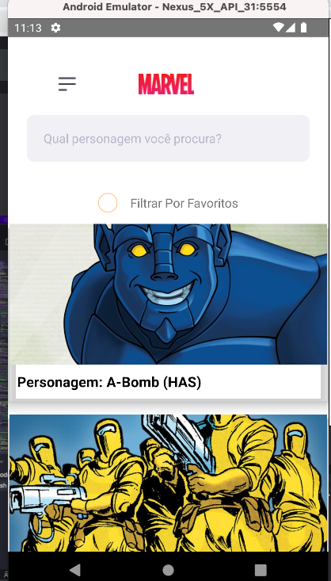

 MarvelApp is Challenge with focus in test habilities about React Native and Ecossystem

 
 

## Screenshots

  

## Features

- ⚛️ **React Native** — Mobile framework that provides an efficient way to create native applications for Android and iOS.
  - Use of ⚛️ React Hooks.
  - Use of axios for communication with api.
  - Use of the styled-coponents library.
  - Use of the react-navigation library for navigation between screens.
  - Use of the react-native-animatable;
  - Use of Redux-Saga for side effects actions

### Mobile:

Run the lines below to launch the application on your physical device or emulator.

    - yarn install.
    - npx react-native start
    - npx react-native run-android(or run-ios)
    - As soon as the process is finished, the application will run on the device that was installed.

    - (if there is an error in the terminal referring to the project libraries, correct by synchronizing the project in android studio or Xcode).
